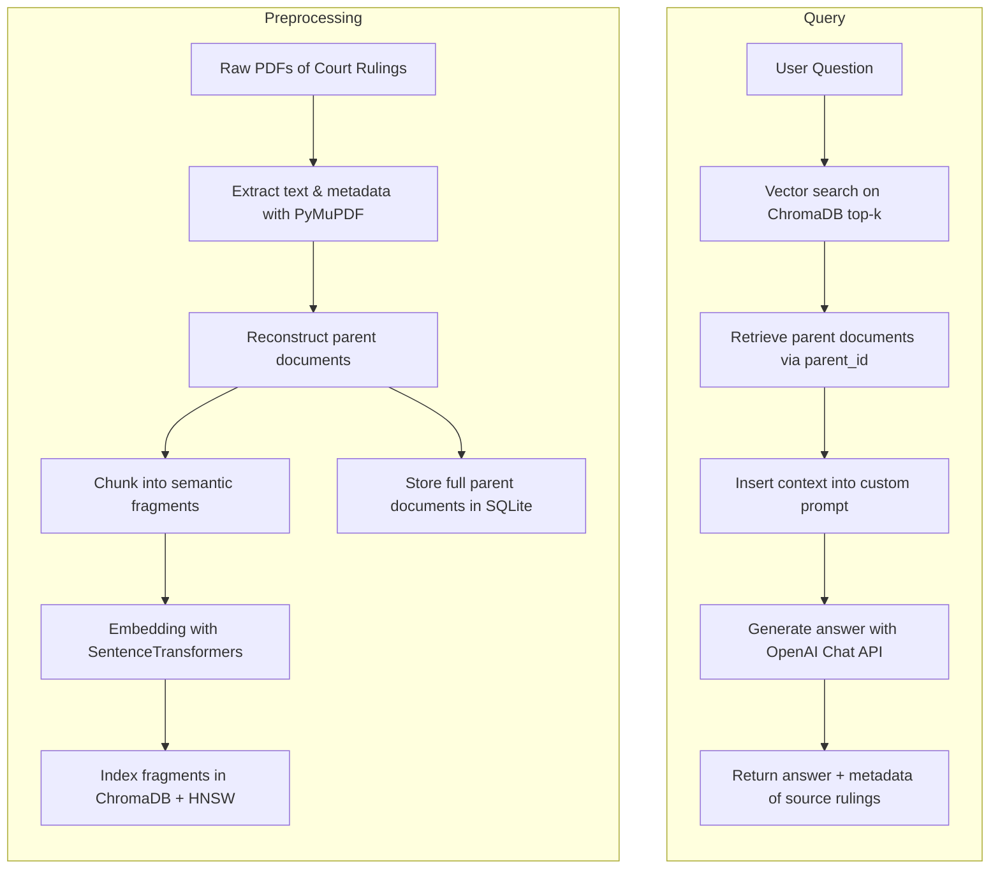
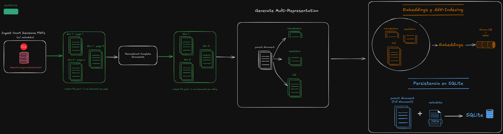

# Jurisprudence RAG AI

A legal assistant powered by Retrieval-Augmented Generation (RAG) for answering complex questions based on Argentine judicial rulings. This project applies modern GenAI techniques to build a domain-specific QA system that is accurate, transparent, and grounded in real legal documents.

## 🧠 Project Purpose

This repository implements an end-to-end pipeline that enables semantic search and generative QA over a corpus of commercial law jurisprudence in Spanish. Users can ask natural language questions and receive AI-generated answers with traceable references **to actual court rulings**. The goal is to reduce hallucinations common in general-purpose LLMs by anchoring generation in a curated, searchable document base.

## 🧱 Architecture Overview

The system follows a classic RAG setup with a few enhancements:
- Preprocessed full judicial rulings (parent documents) are chunked into semantically meaningful fragments.
- Parent documents are stored in a SQLite database (`parent_documents.db`) and are accessed via `app/sqlite_docstore.py`.
- These chunks are embedded and stored in a Chroma vector DB with persistent storage.
- Each chunk keeps a reference to its parent document for traceability and post-filtering.
- At query time, a retriever fetches relevant chunks using vector similarity.
- The final answer is generated using OpenAI's Chat API (via LangChain), using the retrieved context as input.
- The system returns both the response and metadata of the supporting cases.

## ⚙️ Tech Stack

| Layer                | Tool / Library                         | Purpose                                          |
|----------------------|----------------------------------------|--------------------------------------------------|
| Language             | Python                                 | Core implementation                              |
| Vector Store         | Chroma DB + HNSW (ANN)                 | Vector similarity search                         |
| Embeddings           | HuggingFace Sentence-Transformers      | Semantic encoding of chunks                      |
| LLM (Generation)     | OpenAI (ChatOpenAI via LangChain)      | Natural language response generation             |
| Prompt Engineering   | LangChain PromptTemplate               | Custom domain-specific prompt                    |
| UI                   | Streamlit                              | User interface for live interaction              |
| Retrieval Engine     | LangChain MultiVectorRetriever         | Parent-aware semantic retrieval                  |
| PDF Parsing          | PyMuPDF                                | Extract raw text from rulings                    |
| Configuration        | python-dotenv                          | Environment variable handling                    |
| Document Store       | SQLite                                 | Stores full text and metadata of errors          |

## 📁 Main Modules

- `01_generate_documents.ipynb`: Prepares parent documents and metadata.
- `02_generate_chunks_vectordb.ipynb`: Chunks, embeds, and indexes documents.
- `03_generate_LLM_response.ipynb`: Tests query + generation loop.
- `app/get_response.py`: Front-end | Core logic for retrieval, context assembly, and answer generation.
- `app/02_main.py`: Front-end app | Streamlit-based UI to interact with the RAG pipeline.
- `parent_documents.db`: SQLite database with full parent documents + metadata.
- `app/sqlite_docstore.py`: Clase que implementa el docstore sobre SQLite.
- `multivector_chroma_db_hnsw_001/`: ChromaDB + HNSW index de fragmentos.

## 🔁 RAG Pipeline

## 📌 Design Choices

- **Parent-aware chunking**: Each chunk retains a link to its full ruling. This allows grouping retrieved chunks and surfacing metadata alongside answers.
- **Minimal infrastructure**: Everything runs locally (no cloud DBs or orchestration), making it easy to prototype and reproduce.
- **Full Spanish support**: Prompts, documents, and embeddings tailored for Spanish legal language.
- **LLM filtering through prompting**: The LLM in a first-step filter irrelevant documents to provide an accurate answer. 

## 🚧 Improvements in Progress

- Adding more data to de database.
- Adding tests and CI/CD for production-readiness.

---

## 🧠 Author

Built by [@bpeco](https://github.com/bpeco) — AI Engineer focused on tool-using agents, LLM infrastructure and real-world GenAI applications.

---
