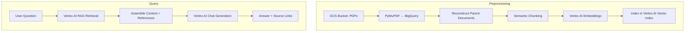

# Jurisprudence RAG AI on Google Cloud

A legal QA assistant powered by Retrieval-Augmented Generation (RAG) using Google Cloud services to answer complex questions based on Argentine judicial rulings.

## 🧠 Project Purpose

This repository implements an end-to-end pipeline for semantic search and generative QA over a corpus of Spanish-language commercial law jurisprudence. By anchoring AI responses in real court rulings, we drastically reduce hallucinations and ensure traceability to the source documents.

## 🏛️ Architecture Overview

* **PDF Ingestion**: Court rulings (PDFs) are stored in a Google Cloud Storage (GCS) bucket.
* **Text & Metadata Extraction**: PyMuPDF processes each PDF and loads extracted text and metadata into BigQuery.
* **Parent Document Assembly**: Full texts with enriched metadata are reconstructed as "parent documents."
* **Semantic Chunking**: Each parent document is split into meaningful fragments (chunks).
* **Embeddings & Vector Store**: Vertex AI Embeddings generates multilingual semantic vectors, which are indexed in a managed Vertex AI Vector Index.
* **Retrieval**: At query time, Vertex AI RAG retrieves top‐k relevant chunks based on semantic similarity against the Vector Index.
* **Generation**: Vertex AI Chat consumes retrieved context and generates a final answer.
* **Traceability**: Every chunk retains references to its parent (GCS URI & BigQuery row), so we can link answers back to specific rulings.


```mermaid
flowchart TD
  subgraph Preprocessing
    A[GCS Bucket: PDFs] --> B[PyMuPDF → BigQuery]
    B --> C[Reconstruct Parent Documents]
    C --> D[Semantic Chunking]
    D --> E[Vertex AI Embeddings]
    E --> F[Index in Vertex AI Vector Index]
  end

  subgraph Query
    Q[User Question] --> R[Vertex AI RAG Retrieval]
    R --> S[Assemble Context + References]
    S --> T[Vertex AI Chat Generation]
    T --> U[Answer + Source Links]
  end
```

## ⚙️ Tech Stack

| Layer                  | Service / Library                     | Purpose                                      |
| ---------------------- | ------------------------------------- | -------------------------------------------- |
| Storage & Ingestion    | Google Cloud Storage (GCS)            | Store raw PDF rulings                        |
| Extraction & Metadata  | PyMuPDF                               | Extract text and metadata                    |
| Structured Storage     | BigQuery                              | Store texts & metadata for SQL analysis      |
| Vector Database        | Vertex AI Vector Index                | Semantic vector indexing                     |
| Embeddings             | Vertex AI Embeddings Multilingual     | Generate chunk embeddings                    |
| RAG & LLM Generation   | Vertex AI RAG, Vertex AI Chat         | Retrieval and answer generation              |
| Orchestration          | Google ADK CLI, Cloud Build pipelines | Automate preprocessing and deployment        |
| Infrastructure as Code | Terraform (infra/)                    | Provision GCS, BigQuery, Vertex AI, IAM, VPC |
| Containerization       | Docker, Docker Compose                | Consistent local & cloud deployments         |
| Presentation Layer     | Streamlit                             | Interactive UI for document management & QA  |

## 📁 Main Modules

* `01_upload_pdfs_to_gcs.ipynb`: Upload court ruling PDFs to GCS and register metadata.
* `02_analyze_pdfs.ipynb`: Analyze PDF text to determine optimal chunk sizes and fragmentation strategy.
* `04_vertex.ipynb`: Create and index the semantic corpus in Vertex AI Vector Index.

### RAG Agent Module

Located in the `rag_agent/` package, this module implements the conversational agent:

```
rag_agent/
├── __init__.py
├── agent.py          # Core agent logic (loop, tool invocation)
├── config.py         # Environment and API key settings
└── tools/
    ├── __init__.py
    ├── add_data.py        # Tool for adding new documents to the corpus
    ├── get_corpus_info.py # Tool to fetch corpus statistics and metadata
    ├── rag_query.py       # Tool to execute retrieval + generation
    └── utils.py           # Shared helper functions
```

## 🔧 Management CLI Tool

We recently developed a command-line interface to simplify corpus and pipeline operations:

* `manage.py`: Entry point for administrative tasks:

  * `python manage.py list-corpora` — List all existing corpora in Vertex AI.
  * `python manage.py add-documents --path /local/pdfs` — Bulk upload PDFs and update BigQuery.
  * `python manage.py delete-corpus --name juris-corpus-2024` — Remove a corpus and its index.

## 🐳 Docker & Containerization

To streamline local development and ensure consistent deployments, we've added Docker support:

* **Dockerfile**: Defines a container image with all Python dependencies, environment variables, and the FastAPI entrypoint.
* **docker-compose.yml**: Orchestrates services for:

  * `rag-agent`: FastAPI backend (port 8000)
  * `streamlit-ui`: Streamlit application (port 8501)
  * `vector-index-mock`: Local mock vector index for offline testing

Run the full stack locally:

```bash
docker-compose up --build
```

## 🚀 Streamlit Web UI

An interactive Streamlit application for demo and prototyping:

* **Location**: `app/streamlit_app.py`
* **Features**:

  * PDF upload via drag-and-drop
  * Status monitoring of ingestion and indexing
  * Live questioning interface against the RAG agent
  * Answer display with clickable source links

Run directly or via Docker:

```bash
streamlit run app/streamlit_app.py
```

## 🔁 RAG Pipeline (Detailed)

1. **Preprocessing**:

   * PDFs ingested to GCS.
   * PyMuPDF extracts text & metadata → BigQuery tables.
   * Parent documents assembled with metadata fields (case number, date, court).
   * Documents split into semantic chunks.
   * Chunks embedded with Vertex AI and indexed in the Vector Index.

2. **Query**:

   * ADK Web receives a user question.
   * Vertex AI RAG retrieves relevant chunk vectors from the Vector Index.
   * Context and metadata (GCS URI, BigQuery row) assembled into prompt.
   * Vertex AI Chat generates a response, including citations to original rulings.

## 📌 Design Choices

* **BigQuery for Metadata**: Enables auditability and complex SQL queries on case attributes.
* **Vertex AI Vector Index**: Leverages Google Cloud’s managed vector search.
* **Google ADK**: Standardizes pipeline orchestration, monitoring, and deployments.
* **End-to-End Spanish Support**: All embeddings, prompts, and UI are tailored for Argentine legal language.

## 🚀 Roadmap & Improvements

* BigQuery integration for structured analytics and metadata management. ✅
* FastAPI production endpoint replacing ADK Web.✅
* Containerized deployments via Docker. ✅
* Streamlit UI enhancements: real-time monitoring, user authentication, and analytics dashboard.

---

## 🧑‍💻 Author

Built by [@bpeco](https://github.com/bpeco) — AI Engineer & CTO at Cíclico, specializing in GenAI infrastructures.
